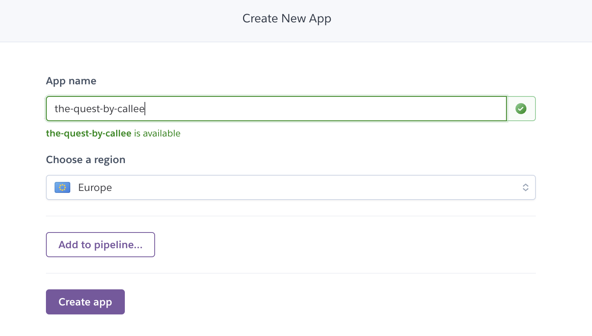

https://patorjk.com/software/taag/#p=display&f=Epic&t=The%20Quest

# The Quest 

The Quest is a story, deployed on Heroku, in which the user takes a part and with their own choices along the way chooses how the story will go on.
It starts of with a Hangman for a fun start.

Try making your own quest [here](https://the-quest-by-calle.herokuapp.com/)!

### The Hangman game

The hangman game is game in which the user guesses on, in this version, guesses on a five letter word randomly choosen from a list with 6 words. 
Before the game starts the user is asked for their name. 
Well started the user has 7 guesses to get the word right. Wether the user gets it right or not the user will after the 7 guesses, or before if they guess it right, enter the storymode of The Quest.

### The Quest

The Quest it self is a multi-choose story mode in which the user decides between 2 given options in teh game mode. For each given answer a new part of the story opens up. Depending on the answer the user gives, multiple endings is avalible. 

### Quiz

Inside the story, there is a quiz that can be taken if choosen the right path. The quiz has nog answers provided so the user may guess away at whatever.

## How to play

The Quest is a fearly simple multichoose game. The user is first asked to enter their name. This leads them to the Hangman game in which the choose a letter. If the user guesses right the given letter will appear on the line ( _ ) in it correct order and a printed statement will appear and the the user know that the guess was correct. If the user guesses wrong the images will update and a printed statment will appear with a message that the guess was incorrect and the users guesses left will also be updated.

When the game is over the user will be taken to the story mode. In the story mode the user will follow and create the stort them self by choosing one of the given answers wich is provided inside (bracets). 

## Features

* The user is greeted with a header and asked to enter a name.

* If entering a number or any other charachters than letters a printed statement appers and tells the user to input correct letters.

* When entering worng guesses in hangman

* The user is provided with options to choose from inside the (bracets) If prining anything different a warning text is printed and the previous text i reprinted.

## Flowcharts
* This is how my thoughts went when planning (and replaning) the quest. Also the structure of the Hangman game

## Deployment to Heroku

This project was deployed on Heroku in the following manner:

1. Log into the [Heroku website](https://www.heroku.com)

2. Click 'New' and choose 'Create new app'. 

3. Choose an app name (this has to be uniqe) and choose a region.

4. Click 'Create app'.

5. You should be on the 'Deploy' tab (1).

6. Choose connect to GitHub account (2).

7. Search for the repository you want to deploy. The name needs to match exactly (3).

8. Click 'Connect' (4).

9. Select whether you want automatic deployment.

10. Choose which branch you want to deploy. 

11. Click 'Deploy branch'

12. When the deployment is complete, go to the 'Settings' page to configure vars and buildpacks. 

13. Click 'Reveal Config Vars'. For this project, we needed PORT 8000 (as a var) and the Node.js and Python buildpacks.

14. Click 'Add' to fill out PORT and 8000 in he KEY / VALUE pair. This has been done.

15. Click 'Add buildpack' and select Python and Node.js from the options. Here you shuold chech the list because Python should be on top. Node.js is over you can just grab and drag Python ontop.

16. Scroll back to the top where you will see 'Open app'. BEFORE opening, you will need to redeploy as the first deployment happened before Node.js was installed as a buildpack. If you open now, there will be an error.

## Testing.

* Since the pip8online wbesite is down I installed the Pep8 to my Gitpod workspace as the information from Code Institute suggested.

* Some errors still exists but have no effect in the runnning of the story and games. Most of them is referring to the header "image".

* Tested for bugs.
* Tested for functionality
* All options and scenarios tested

#### Bugfixes

* I had some problems with some while loops the wheren't breaking correctly. The should now be working fine.

## Credits

* Template used from Code Institute.

* Idea from Kaylae Smith for sleep function and then google search.

* Many codealongs with [Tech With Tim](https://www.youtube.com/c/TechWithTim) and [Mosh Hamedani](https://www.youtube.com/c/programmingwithmosh)

* And as always a big thanks to my brilliant mentor Harry Dhillon